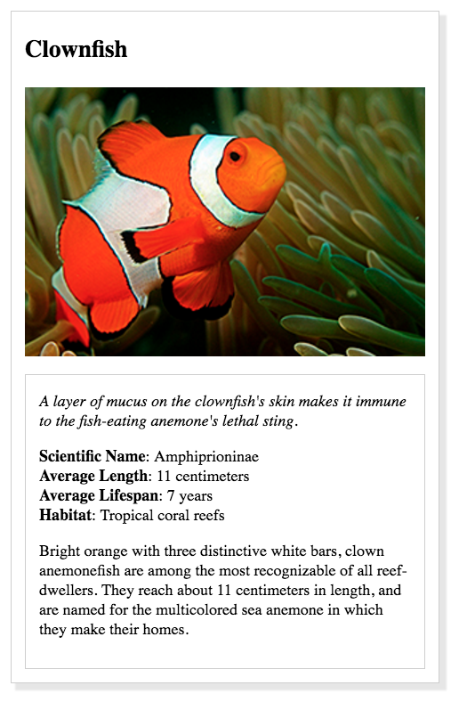

# animaltradingcard
fewd-challenge html &amp; css
Design an animal trading card using html and css to look like
the design prototype from the Google Udacity fewd challenge.

Source of photo: Photo by Nathan Anderson on Unsplash
Course work for Front-End Web Developer track
Info from https://en.wikipedia.org/wiki/Red_fox

 

 
